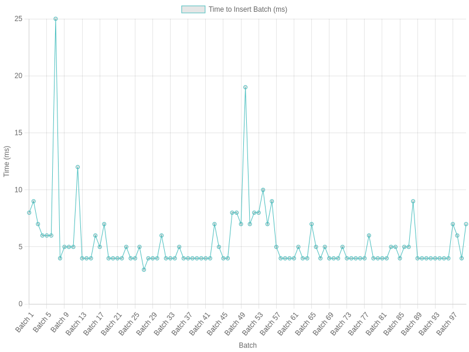

# OUID (Optimized Unique Identifier)


Node.js package designed to generate optimized unique identifiers (OUID) that incorporate both a timestamp and a random component. These identifiers are suitable for a variety of applications, including database keys, session identifiers, and unique references in distributed systems.

## Installation

Install the package using npm:

```bash
npm install ouid-h47
```

## Usage

```javascript
const { ouid } = require("ouid-h47");

// Generate a new optimal ID
const newID = ouid();
console.log("Generated optimal ID:", newID);
```

## Performance

The performance chart below illustrates the time taken to insert batches of IDs into a MySQL database using ouid. Each batch represents a set of IDs generated and inserted sequentially.



### Performance Testing Details

The performance testing was conducted using a Node.js script (`test-load.js`) that simulates inserting batches of IDs into a MySQL database. Each batch contains a number of IDs generated by ouid, and the time taken to insert each batch was recorded.

The data reflects the average time (in milliseconds) required to complete each batch insertion, providing insights into the efficiency and scalability of ouid in real-world database operations.

### Interpretation

- **Batch Insertion Time**: Indicates how quickly ouid can generate and insert IDs into a database.
- **Scalability**: The consistent performance across batches demonstrates the package's reliability even under load.
- **Optimization**: By leveraging both timestamp and random components, ouid ensures efficient indexing and sorting of IDs within the database.

This performance data highlights the suitability of ouid for applications requiring fast and reliable unique identifier generation, such as high-throughput systems and distributed databases.

## API

`ouid()`

Generates a new optimal ID composed of a timestamp and a random string.

- Returns: string - A unique ID with 26 characters (10 timestamp + 16 random).

## Contributing

Contributions are welcome! For major changes, please open an issue first to discuss what you would like to change.

Please make sure to update tests as appropriate.

## License

This project is licensed under the ISC License - see the [LICENSE](LICENSE) file for details.
